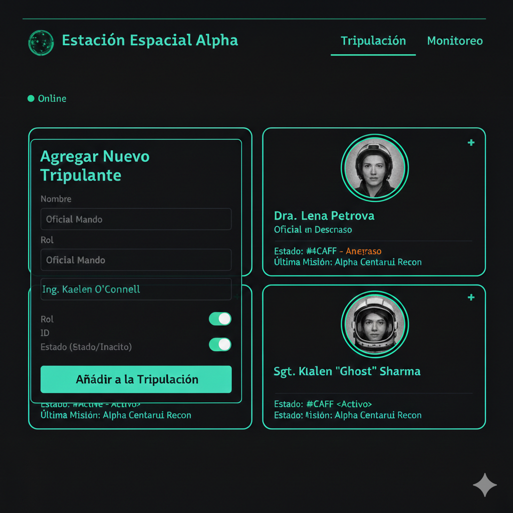
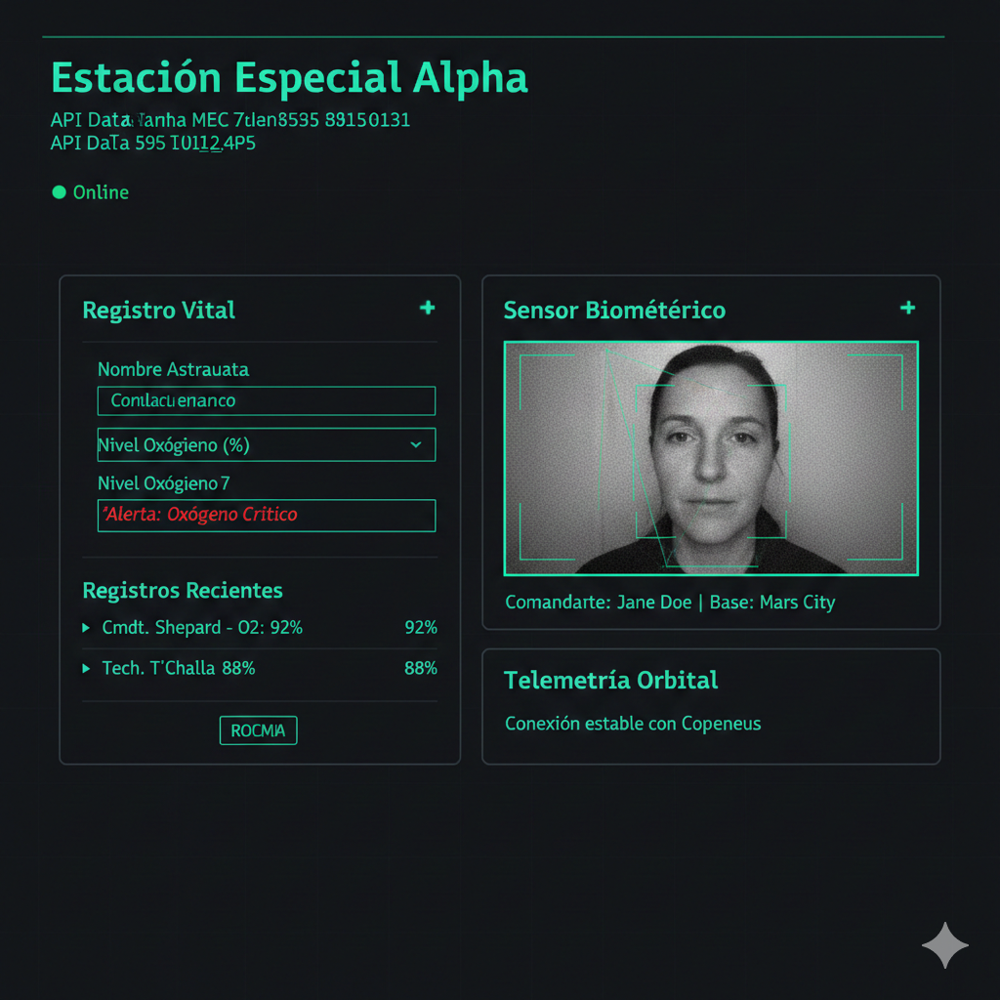
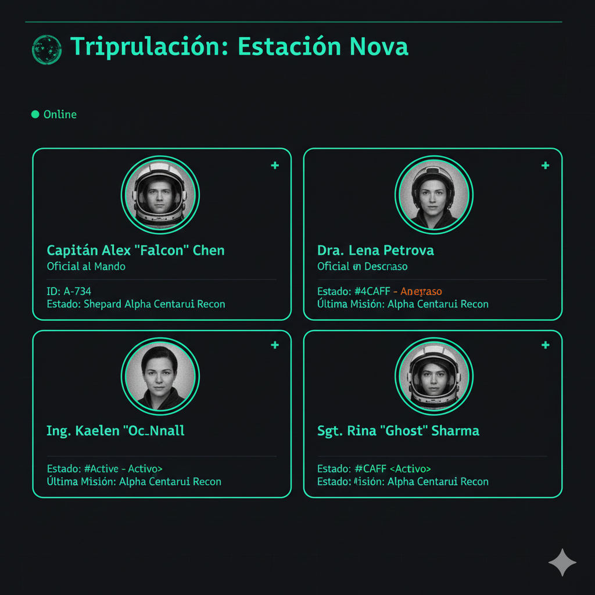
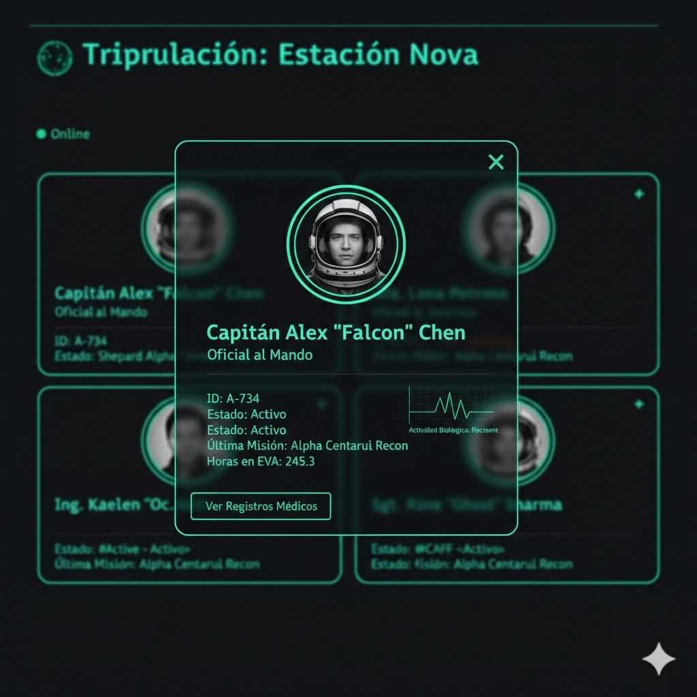
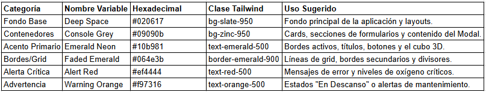

# Protocolo Alpha

## Layout


# Vista monitoreo


# Vista tripulación


# Vista tripulante


## Estación Espacial "Alpha"
- Guía de Construcción Paso a Paso
- Este proyecto unifica todo lo aprendido: Next.js (Semana 1), Lógica de Objetos (Semana 2), Efectos y APIs (Semana 3) y Formularios y Grid    (Semana 4).

### PASO 0: Paleta de colores



### PASO 1: Preparación del Terreno (Estructura)
Antes de programar, organiza tu espacio de trabajo.

- Crea las rutas: En la carpeta app, crea dos carpetas: monitoreo y tripulacion. Cada una debe tener su propio page.tsx.

- Crea la carpeta de componentes: Dentro de app/components, crea los archivos: Navbar.tsx, Formulario.tsx, Scanner.tsx, CardTripulante.tsx y   SensorIngenieria.tsx.

- Layout Global: En app/layout.tsx, importa el Navbar para que aparezca en todas las páginas.

### PASO 2: El Esqueleto (Grid Layout)
- En el archivo app/monitoreo/page.tsx, vamos a usar el grid de Tailwind.

- Orden: Configura un contenedor con la clase grid.

- Móvil: Debe tener 1 columna (grid-cols-1).

- Escritorio: A partir de md, cambia a 12 columnas (md:grid-cols-12).

- Distribución: El componente de Formulario debe ocupar 5 espacios (col-span-5) y el Scanner 7 espacios (col-span-7).

### PASO 3: Formulario de Oxígeno (Lógica de Referencias)
* En app/components/Formulario.tsx:

- React Hook Form: Registra dos inputs: "Nombre" y "Nivel O2".

- Validación Inline: Si el O2 es menor a 80, muestra un mensaje en rojo: "¡Alerta Crítica!".

- Estado y Memoria: Crea un estado logs. Al enviar el formulario, usa el Spread Operator [...logs, nuevoRegistro] para añadirlo a la lista.

* Nota: Recuerda que en JS los arrays son referencias; si usas .push(), React no se enterará del cambio.

### PASO 4: Sensor Biométrico (useEffect y useRef)
* En app/components/Scanner.tsx
- La Referencia: Crea un const videoRef = useRef(null) y conéctalo a un tag video

- El Efecto: Usa useEffect para pedir permiso de cámara al navegador con navigator.mediaDevices.getUserMedia.

- Asincronismo: Usa async/await para manejar la respuesta de la cámara.

- Estilo: Añade la clase grayscale de Tailwind al video para que parezca un sensor antiguo.

### PASO 5: Lista de Tripulantes (API y Cards)
En app/tripulacion/page.tsx:

- Fetch de Datos: Usa una función asíncrona para obtener los datos de la tripulación ([API usuarios](https://dummyjson.com/users)). toma 10 usuarios de la respuesta (filtra el arreglo)

- Destructuring: Al mapear la lista, extrae los datos así: const { name, role, status } = tripulante.

- Componente Reutilizable: Pasa esos datos al componente CardTripulante.

- Diseño: Usa una Grid que muestre 1 columna en móvil y 4 en pantallas grandes.

### PASO 6: Dialogo datos personales

El objetivo es mostrar los detalles de un tripulante en una ventana emergente al hacer clic en su tarjeta.

1. Preparación e Instalación
Instala el componente necesario desde la terminal:

```Bash
npx shadcn-ui@latest add dialog
```
2. Lógica de Control (State)
En tu componente de lista (tripulacion/page.tsx), define quién es el tripulante activo:

```typescript
Estado: const [selected, setSelected] = useState(null);.
```
Activación: Al hacer clic en la Card, ejecuta setSelected(tripulante).

3. Implementación del Componente Dialog
Estructura básica dentro del bucle de tarjetas:

```tsx
DialogTrigger: Envuelve tu componente CardTripulante.

DialogContent: Define el diseño del expediente (estilo modal).

Header: Nombre y ID del tripulante.

Body: Datos extra (Horas de vuelo, biometría).

Estilo: Usa bg-slate-900 y border-emerald-500 para mantener la estética visual de las imágenes anteriores.*
```