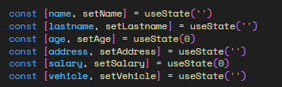

# Introducción a formularios y UX 


Imaginense que tienen los siguientes estados para controlar su formulario



NOTA:// Recordar que los hooks solamente son en el cliente 

## Preguntas de aprendizaje 

¿Qué debo agregar a los archivos en su primera línea cuando utilice hooks o interacción en general con el usuario?

¿Cómo se sentirían si tuvieran que agregar más campos al formulario? Más incómodos ? Abrumados muchas variables?

¿Cómo ejecuto el proyecto?

Es bastante común que los formularios crezcan en procesos de negocios más complejos que requieren validar diferentes entradas.

### Solución para formularios =>  React Hook Form

## Preguntas de aprendizaje

¿Si se llama useForm va en el cliente o en el servidor?

¿Cómo puedo instalar dependencias en un proyecto de javascript?

¿En cuál archivo puedo ver las dependencias del proyecto? 

¿Cuál es la diferencia entre dependencia y dependencia de desarrollo?

¿Recuerda que pasa cada vez que la variable del useState cambia?

```typescript

//React hook form
npm install react-hook-form @hookform/resolvers zod

//Componentes Shadcn
npx shadcn@latest add dialog toast input label textarea

```

###  Convocatoria primera tripulación a Marte (Ir ejecutando paso a paso)

Marcianos SAS le solicita lo siguiente:

* Cree una vista /crew con un formulario
* Solicite al usuario nombre, edad, descripción de por qué quiere ir a Marte
* Agregué un botón que tenga el texto iniciar postulación

```typescript 
//Ejemplo de creación hook para gestionar estado de formulario
const { register, handleSubmit, watch, formState: { errors } } = useForm({
    defaultValues: { name: "", bio: "" }
  });
```

# Preguntas de aprendizaje

* Analizando los valores que destructura el hook qué cree que significa cada uno? 
* ¿ El formulario se renderiza en el cliente o en el servidor?


El equipo de producto se le olvidó que debe agregar las siguientes funcionalidades:
* El usuario solo puede escribir una descripción de 100 carácteres
* El campo de texto debe tener debajo un contador de carácteres en el formato <num_caracteres_Actuales>/100
* Cuando los cáracteres sean > 90 el texto del contador debe ser naranja

```typescript
// Para condiciones en el template JSX apoyese de los operadores ternarios
// Ejemplo

{a > 10 ? 'naranja' : 'gris'}
{a + b> 5 ? 'negro' : 'gris'}

```
* La función watch de useForm  usela para estar pendiente de los cambios en alguna entrada (longitud de texto)

```typescript
// Observar cambios en un input
const bioContent = watch("bio");
```


* Cuando el usuario haga clic mostrar un Toast que diga 'Datos enviados a Marte' 
* Posterior al toast mostrar un dialogo (Dialog) con el título ¡Postulación Recibida! y contenido 'Tu expediente ha sido enviado a la estación orbital. Nos pondremos en contacto si superas las pruebas físicas.'
* El Dialog debe tener un botón Entendido que debe cerrar el Dialog. (Utilicen un estado para controlar que este abierto/cerrador el dialog)

# Configuración JSX FORM
```typescript
// el botón de submit activa automaticamente el handleSubmit del form
// jsx utilice el tag form y asocielo de la siguiente forma 
<div>
<form onSubmit={handleSubmit(onSubmit)}>

//INPUTS
        <Button type="submit" className="w-full sm:w-auto bg-blue-600 hover:bg-blue-700 transition-all uppercase tracking-widest font-bold">
          Iniciar Postulación
        </Button>
</form>
// CÓDIGO DIALOG

<div>


```

# Configuración Input con su respectivo error y validaciones
```typescript
            <Input 
            {...register("name", { required: "El nombre es obligatorio", minLength: { value: 3, message: "Mínimo 3 caracteres" } })}
            placeholder="Ej. Neil Armstrong"
            className={errors.name ? "border-red-500 focus:ring-red-500" : "bg-zinc-800 border-zinc-700"}
          />

          {errors.name && <p className="text-red-500 text-xs italic">{errors.name.message}</p>}

```

# y esas clases ???

Vamos a utilizar una librería utilitaria para este ejemplo llamada [tailwind](https://tailwindcss.com/docs/installation/framework-guides/nextjs) 

* Siga la instalación y pruebe el siguiente tag con las clases, debería ver la letra grande, subrayada y en negrilla

```html
    <h1 className="text-3xl font-bold underline">
      Hello world!
    </h1>
```


# Tailwind es mobile first

Entendamos el siguiente código, agreguemos este html a una vista que desee

# Preguntas de análisis 

- Antes de analizar por favor copie y pegue el código en la vista que usted desee
- ¿Cuál parte de las clases utilitarias controlan el layout según la pantalla? 


```html
<div className="p-4">
  <h2 className="text-xl font-bold mb-4 text-center">Visualizador de Responsive (Tailwind)</h2>
  
  {/* grid-cols-1: 1 columna en móvil
    sm:grid-cols-2: 2 columnas en tablets (pequeño)
    md:grid-cols-3: 3 columnas en laptops (mediano)
    lg:grid-cols-4: 4 columnas en monitores (grande)
    gap-4: separación entre cuadrados
  */}
  <div className="grid grid-cols-1 sm:grid-cols-2 md:grid-cols-3 lg:grid-cols-4 gap-4">
    
    {/* Cuadrado 1 */}
    <div className="h-32 bg-red-500 rounded-lg flex items-center justify-center text-white font-bold shadow-lg">
      1 (Red)
    </div>

    {/* Cuadrado 2 */}
    <div className="h-32 bg-blue-500 rounded-lg flex items-center justify-center text-white font-bold shadow-lg">
      2 (Blue)
    </div>

    {/* Cuadrado 3 */}
    <div className="h-32 bg-green-500 rounded-lg flex items-center justify-center text-white font-bold shadow-lg">
      3 (Green)
    </div>

    {/* Cuadrado 4 */}
    <div className="h-32 bg-yellow-500 rounded-lg flex items-center justify-center text-black font-bold shadow-lg">
      4 (Yellow)
    </div>

    {/* Cuadrado 5 */}
    <div className="h-32 bg-purple-500 rounded-lg flex items-center justify-center text-white font-bold shadow-lg">
      5 (Purple)
    </div>

    {/* Cuadrado 6 */}
    <div className="h-32 bg-pink-500 rounded-lg flex items-center justify-center text-white font-bold shadow-lg">
      6 (Pink)
    </div>

  </div>
  
  <p className="mt-6 text-sm text-gray-500 text-center italic">
    Cambia el tamaño de la ventana para ver cómo cambian las columnas.
  </p>
</div>
```

# Preguntas de aprendizaje

* ¿Qué es un layout responsivo?
* Esta listo para hacer sus layouts responsivos? 


