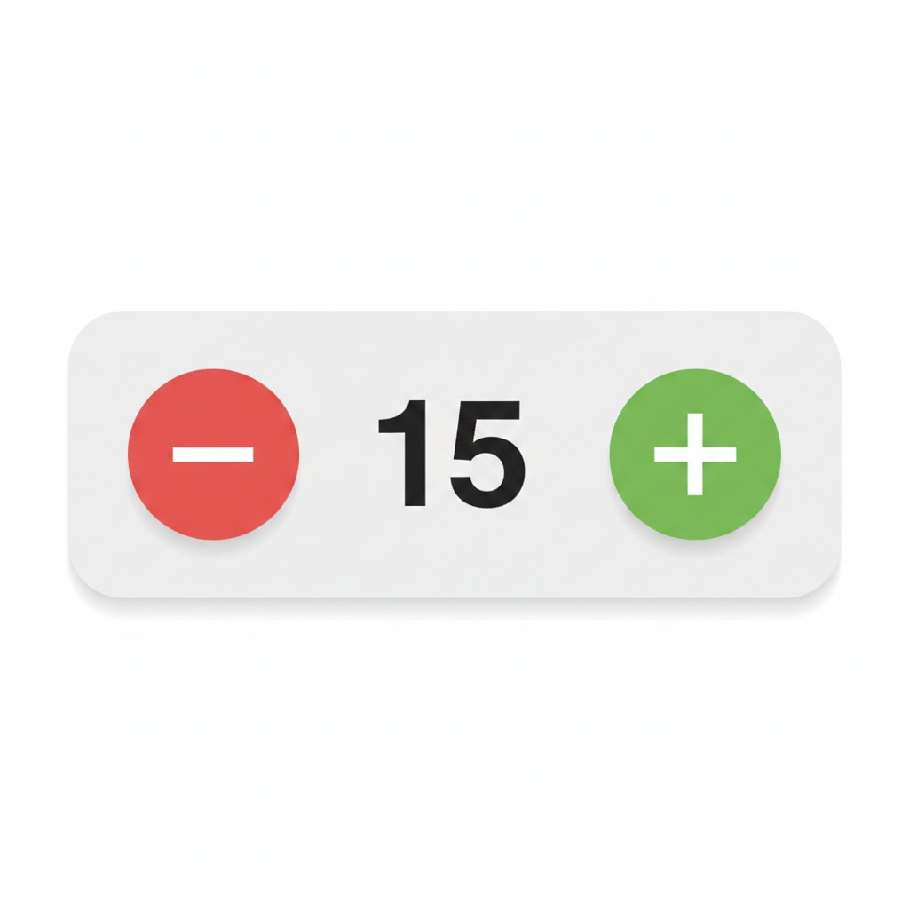

# Introducción a hooks, eventos, primeros formularios

## useState
Esta función la vamos a usar para manejar el estado en nuestros componentes de cliente (interacción con el usuario)

* Es importante tener en cuenta que en react no se asignan variables con = , todo se maneja con funciones.
# NOTA: TODOS LOS HOOKS SIGUEN EL PATRON use<...> Y VAN ANTES DEL RETURN

ejemplos de declaración de variables
```javascript
const [counter, setCounter] = useState(0);
const [role, setRole] = useState('user');
const [isLoading, setIsLoading] = useState(true)
const [newProperty, setNewProperty] = useState({
    zone: "",
    price: "",
    hasOxygen: false
});
```
para usar dentro del return y template HTML usamos {counter} {role} {<variable-name>}

ejemplos de asignación
```typescript
setCounter(5)
setRole('admin')
```


# Funciones flecha 

Funciones utilizadas para manejar la lógica dentro del componente 

```typescript
const functionName = () => {
 //CODE LOGIC

}
// Pueden seleccionar el nombre que deseen para la función

const sumar = (x: number,y: number) => {
    return x + y;
}

const updateMultiState = () => {
    setCounter(15)
    setText('Menor')
    setIsLoading(false);
}

const submitForm = (data: object) => {
    setProperty(data)
    backend.post(data)
}

// La función será ejecutada desde otras funciones o dentro del return (código JSX)
```


# JSX (Javascript XML o Javascript Syntax)


```jsx
return ( 
    <>
    <h1>My Component</h1>
    <Input>....</Input>
    </>
)


return ( 
    <div>
    <h1>My Component 2</h1>
    <Form>...</Form>
    <button>Enviar</button>
    </div>
)


return ( 
    <div>
    <Component1>
    <Component2>
    </div>
)

// Es una mezcla de HTML, Javascript, verás muchos componentes ya sea de react o otras librerias
```


### Estructura de componentes con renderizado en el cliente
```elixir
 1. hooks
 2. funciones
 3. return con jsx (HTML + JS)

```


# Un ejemplo de componente completo se vería asi
```typescript
'use client'  //componentes de interacción usuario botones, formularios, hardware, etc..
import {useState} from 'react'

const MyComponent = () => {
    const [title, setTitle] = useState('')

    const submitTitle = () => {
        if(title === ''){
            return alert('No puede estar vacío')
        }
        backend.post(title)
        alert('titulo guardado')
        
    }

     return (
        <div>
            <h1>{title}</h1>
            <input type="text" onChange={(e) => setTitle(e.target.value) }>
            <button onClick={submitTitle}>Actualizar Título</button>
        </div>
     )

}


```


Ahora vamos a crear un componente para configurar un domo en Marte

1. Cree un estado donde almacenar el nombre
2. Cree un tag h1 para mostrar el nombre del domo en tiempo real 
3. Defina una función flecha para cambiar el nombre del domo y que reciba un parámetro
4. Retornar una h1 con el título y una caja de texto donde se va cambiar el título y cambia el título en tiempo real


Notas: Los elementos HTML interactivos como btns, inputs, etc.. tienen eventos asociados siguen el patrón on<EventName> (onClick, onChange, etc..)

Lista de eventos en javascript: https://www.geeksforgeeks.org/reactjs/react-events-reference/

Ayudas: useState, template Strings, eventos, onChange


# Ejercicio contador
Vamos  a crear el siguiente componente



## Preguntas para guiar aprendizaje
* ¿ Tiene la variable de estado ?  
* ¿ Tienes las funciones para gestionar la variable de estado ?
* ¿ Renderiza correctamente el componente de la imagen?  
* ¿ Toda la lógica es del contador o hay elementos adicionales?

# Hook personalizado 

Vamos a crear el useCounter durante la clase

1) Vamos a crear una carpeta de hooks para almacenar todas nuestras funciones puede ser para cada vista o una carpeta shared compartida para todos
2) Vamos a crear la función useCounter en un archivo nuevo useCounter.tsx
3) Vamos a mover la lógica del contador que estaba en el componente a la función useCounter
4) La función debe retornar los elementos que se requiere en el componente (variable, funciones de cambio y reset)
5) Vamos a importar nuestro nuevo hook personalizado // pista: destructurar de la respuesta que retorna la función