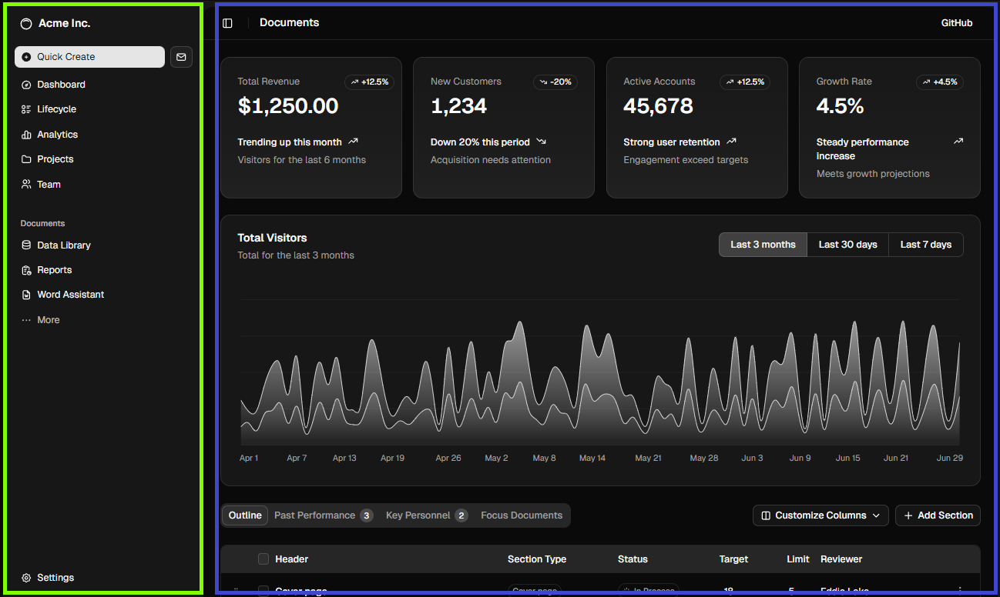
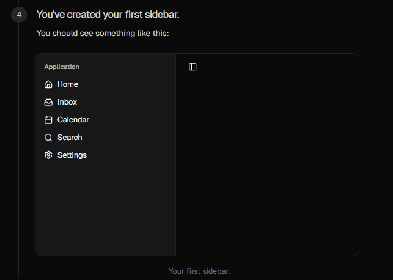
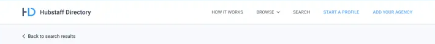

### Primeros pasos en NextJS y React

Para optimizar nuestro flujo de trabajo vamos a utilizar los siguientes Snippets


React: https://marketplace.visualstudio.com/items?itemName=dsznajder.es7-react-js-snippets
NextJS: https://marketplace.visualstudio.com/items?itemName=yuzu.snippets-next-13 


Para empezar vamos a agrupar nuestras vistas a través de un elemento de NextJS llamado layout. 
```
El nombre del archivo es layout.tsx
Se tiene uno global para toda la app
Luego cada hijo puede tener su propio layout    
```


### Ejemplo UI
# El color verde será nuestro layout y el azul nuestros hijos (children)
# El azul cambiará dinámicamente dependiendo que enlace se seleccione en el padre
Usos más comúnes son autenticación, agrupación de vistas, transmisión de datos a sus componentes hijos

Los archivos de layout se ven de la siguiente forma
```
export default function RootLayout({
  children,
}: Readonly<{
  children: React.ReactNode; // Children hará referencia a todos los hijos o también carpetas hijas de la carpeta donde exista un page.tsx
}>) {
  return (
    <html lang="en">
      <body
        className={`${geistSans.variable} ${geistMono.variable} antialiased`}
      >
        {children}
      </body>
    </html>
  );

```

Ejemplo con el proyecto

Vamos a simular la vista de la foto de la siguiente forma

primero nos apoyamos de nuestro componente de Shadcn UI, revisar guía intro-js para reforzar. 
```
npx shadcn@latest add sidebar //instalar sidebar 
```

### Práctiquemos como seguir una documentación 
## guía de sidebar: https://ui.shadcn.com/docs/components/radix/sidebar

Vamos a llegar todos a este punto



¿Preguntas?

## SSR (Server Side Rendering VS Client Side)

* Usamos SSR para optimizar el SEO y velocidad de carga inicial, todo viene preparado desde el servidor 
* Usamos CSR para agregar interactividad (clicks, formularios, botones, cámara, sensores, etc..) 
```
Para usar CSR recuerda agregar la línea "use client" al inicio del archivo

** Si se te olvida NextJS te lo va recordar
```

## Componente Inteligente (Smart) vs Componente 'Bobo' (Dumb)
- Los componentes inteligentes permiten interacción con el usuario (creación, actualización, clicks, llenado de formularios)
- Los componentes bobos solamente renderizan información en la UI


# Mars Solutions SAS

Los han contratado para comenzar a vender activos en Marte, le están solicitando la siguiente vista


Tenemos las siguientes propiedades disponibles para vender 
```
const MARS_LISTINGS = [
  { id: 101, zone: "Olympus Mons", price: 500000, view: "Volcán Gigante" },
  { id: 102, zone: "Valles Marineris", price: 250000, view: "Gran Cañón" },
  { id: 103, zone: "Gale Crater", price: 150000, view: "Ruta del Rover Curiosity" },
];
```

Cree un componente que se va encargar de mostrar en la pantalla todas las propiedades disponibles. Organicelo en cards donde se pueda ver la información de cada propiedad.

ayuda: map 


¿Vieron las diapositivas? 

### Estructura de componentes con renderizado en el cliente
```
 1. hooks
 2. funciones
 3. return con jsx (HTML + JS)

```

# Ejercicio
 Agregué a su sidebar un elemento administrador, esta vista tendrá los siguientes hijos usuarios, propiedades, contratos y perfil. Por favor maneje la navegación de la vista administradora con tabs. como en este ejemplo 



Generé código usando su IA  de preferencia llenar esas páginas (usuarios, propiedades, contratos y perfil). 

Fenced code block with 3 leading spaces, then 4 tokens
3 tokens - shouldn't end code block
~~~
And now 4 tokens to end code block
Snippets Atajos: lrc => layout y prc => page.tsx
Generé código usando su IA  de preferencia llenar esas páginas (usuarios, propiedades, contratos y perfil). 
